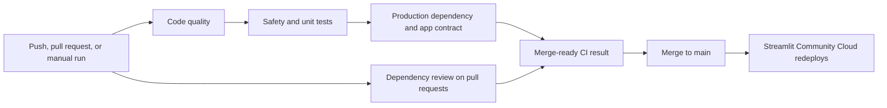

# Vita AI workflow pipeline

## Problem statement

Plant disease symptoms can look very similar, while real-world leaf photos vary in lighting,
focus, background, crop variety, disease stage, and visible damage. A conventional image
classifier can still return a high-confidence label when the image is outside its training
distribution. Because Vita AI's model predicts a combined crop-and-condition class, one wrong
class can display both the wrong plant and the wrong disease.

Vita AI therefore needs to do two things well:

1. Screen a known, supported crop without presenting an uncertain result as a diagnosis.
2. Prevent code, dependency, or model-contract changes from silently weakening that safety
   behavior.

The application is educational decision support. It does not replace field inspection,
laboratory testing, or advice from a qualified agricultural professional.

## Solution

The user first identifies the crop and uploads a genuine JPEG or PNG leaf image. Vita AI checks
the image's technical usability, converts it to the CNN input format, and ranks only the model
classes that belong to the selected crop. The application shows a condition only when all three
reliability gates pass:

- selected-crop support is at least 70%;
- the leading within-crop score is at least 95%;
- the margin over the next within-crop candidate is at least 15 percentage points.

If any gate fails, Vita AI returns **No reliable disease match** and withholds condition-specific
guidance and Grad-CAM. This abstention is safer than presenting a confident but unsupported
answer. Photo quality and model confidence are shown as screening signals, not proof that a
diagnosis is correct.

## GitHub Actions pipeline

The pipeline is defined in `.github/workflows/ci.yml`.

| Stage | What it verifies | Why it matters |
| --- | --- | --- |
| Code quality | Ruff linting, formatting, and Python compilation | Catches syntax, style, and maintainability regressions quickly. |
| Safety and unit tests | Image validation, preprocessing, crop-constrained abstention, label order, database rollback, reports, and artifact hashing | Protects the behavior that prevents misleading screening results. |
| Production dependency and app contract | Full production dependency installation, `pip check`, application import, 38 output classes, and `224 x 224` input size | Detects dependency conflicts and accidental drift from the deployed model contract. |
| Dependency review | Newly introduced high-severity vulnerable dependencies on pull requests | Blocks risky dependency changes before merge. |

GitHub Actions does not train the CNN or claim field accuracy. Model training and evaluation need
an approved dataset, suitable compute, untouched test data, and review of the generated evidence.
The model artifact remains pinned by size and SHA-256 checksum and is downloaded at deployment
runtime rather than committed to Git.

## Delivery flow

1. Create a feature branch and open a pull request.
2. Wait for all required CI checks to pass.
3. Review user-visible and safety-sensitive changes before merging.
4. Merge to `main`.
5. Streamlit Community Cloud observes the repository change and redeploys the application.
6. Verify the live app version, model-ready state, crop selector, and abstention behavior.

The final live verification is intentionally a human release check because a green CI run does not
prove real-world diagnostic performance or confirm that an external hosting service completed its
deployment.
